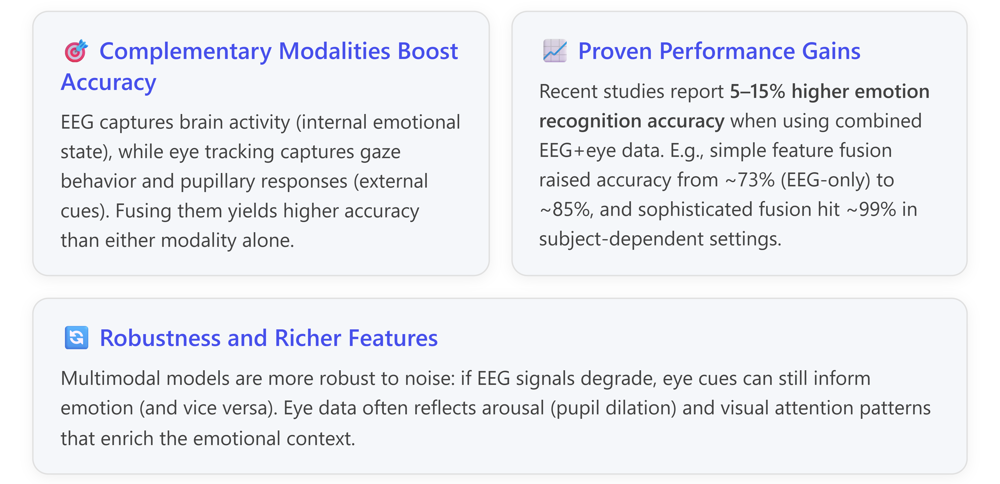
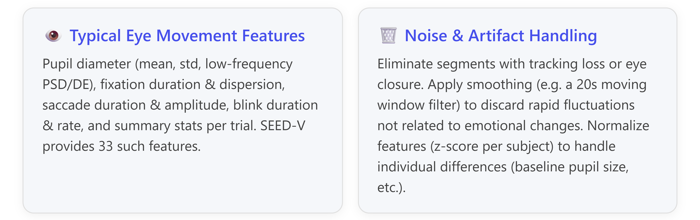

# Integrating Eye-Tracking Data into EEG-Based Emotion Classification

Combining eye-tracking data with EEG signals can significantly improve emotion recognition performance by providing complementary information about a user’s **external behavioral cues** (via eye movements) and **internal neural state** (via EEG). In recent years (2021–2025), state-of-the-art approaches on datasets like **SEED-V** (a 5-class emotion EEG+eye dataset) have explored various strategies to extract and fuse eye movement features with EEG features. This report covers how to implement such integration in a deep learning pipeline, including **feature extraction**, **fusion methodologies (early, late, hybrid)**, their impact on model performance, and best practices/challenges reported in literature. [\[ijcai.org\]](https://www.ijcai.org/Proceedings/15/Papers/169.pdf)

***

## Why Combine EEG and Eye-Tracking for Emotion Recognition?

<!-- Copilot-Researcher-Visualization -->



**Key example:** Using both EEG and eye-tracking, <ins>Lu *et al.* (2015)</ins> achieved **87.6%** accuracy on 3-class emotion recognition, versus \~78% with EEG-only or eye-only inputs. More recently, <ins>Liu *et al.* (2022)</ins> report **85.3%** on 5-class SEED-V using deep multimodal fusion, far surpassing \~73–79% from unimodal models. These gains underscore that EEG and eye movement signals provide **complementary emotional information** – EEG reflects implicit affective neural responses, while eye metrics indicate visual focus, surprise, and arousal levels. [\[ijcai.org\]](https://www.ijcai.org/Proceedings/15/Papers/169.pdf) [\[bcmi.sjtu.edu.cn\]](https://bcmi.sjtu.edu.cn/home/liuwei/Wei%20Liu's%20HomePage_files/TCDS-2021.pdf)

***

## Eye-Tracking Features: Extraction and Preprocessing

Integrating eye data starts with extracting meaningful features from raw eye-tracking recordings. Modern emotion studies use **video-based eye trackers** (e.g. SMI eye-tracking glasses in SEED-V) that record gaze coordinates, pupil size, blinks, fixations, and saccades. Key steps and best practices: [\[arxiv.org\]](https://arxiv.org/pdf/2311.10155v1)

*   **Synchronize and Align**: Eye-tracking data often has a lower sampling rate than EEG. For instance, SEED-V’s SMI glasses operate at \~120 Hz vs EEG at 1000 Hz. **Resample or downsample** to align timestamps. In practice, one might downsample EEG to 200 Hz and upsample eye data slightly so both modalities have synchronized frames. [\[ijcai.org\]](https://www.ijcai.org/Proceedings/15/Papers/169.pdf)

*   **Pupil Diameter Processing**: Pupil size is a known indicator of emotional arousal, but it’s heavily affected by ambient lighting. **Remove the light reflex** from pupil signals to isolate emotion-related changes. A common method is PCA-based filtering: use a principal component (across subjects watching the same stimulus) as an estimate of the lighting-driven pupil response, then subtract it. This yields a residual pupil signal more indicative of emotion (with noise remaining). [\[bohrium.com\]](https://www.bohrium.com/paper-details/from-eeg-to-eye-movements-cross-modal-emotion-recognition-using-constrained-adversarial-network-with-dual-attention/1171002222503264310-2493) [\[ijcai.org\]](https://www.ijcai.org/Proceedings/15/Papers/169.pdf)

*   **Feature Extraction from Eye Signals**: Instead of using raw gaze coordinates or time-series directly, most SOTA approaches compute statistical and frequency-domain features per trial:

    *   *Pupillometry Features*: Mean and standard deviation of pupil diameter (after light correction) and its power spectral density (PSD) or differential entropy (DE) in low-frequency bands (0–1 Hz). Slow oscillations in pupil size reflect emotional arousal and cognitive load. [\[ijcai.org\]](https://www.ijcai.org/Proceedings/15/Papers/169.pdf)

    *   *Fixation Features*: e.g. average fixation duration (how long the subject’s gaze stays on one point) and fixation dispersion (variance of gaze position during a fixation). Emotions like interest or surprise can affect how long and steadily one looks at stimuli. [\[ijcai.org\]](https://www.ijcai.org/Proceedings/15/Papers/169.pdf)

    *   *Saccade Features*: e.g. mean and std of saccade duration and saccade amplitude (in degrees). Larger or more frequent saccades might indicate scanning due to anxiety or curiosity. [\[ijcai.org\]](https://www.ijcai.org/Proceedings/15/Papers/169.pdf)

    *   *Blink Features*: average blink duration and blink frequency. Certain emotional states (e.g. stress) can change blink rate.

    *   *Event Statistics*: counts or extremes in events per trial – e.g. total number of blinks, total number of fixations, maximum fixation duration, total saccade count, average saccade latency (time between saccades). [\[ijcai.org\]](https://www.ijcai.org/Proceedings/15/Papers/169.pdf)

<!-- Copilot-Researcher-Visualization -->



After preprocessing, you will have a feature vector for each trial/video segment, e.g. a 33-dimensional eye feature vector for SEED-V. Similarly, EEG data is reduced to feature representations (commonly 310-D vector of DE features: 62 electrodes × 5 bands). Now the challenge is to **fuse these modalities** effectively. [\[arxiv.org\]](https://arxiv.org/pdf/2311.10155v1) [\[ijcai.org\]](https://www.ijcai.org/Proceedings/15/Papers/169.pdf)

***

## Fusion Strategies for EEG + Eye Features

Fusing multimodal data can be done at different stages of the modeling pipeline. The main approaches are **early fusion (feature-level)**, **late fusion (decision-level)**, and **hybrid or mid-level fusion**. Modern deep learning methods also introduce specialized multimodal fusion architectures.

### 1. Early Fusion (Feature-Level)

**What it is:** Combine EEG and eye features into a single feature vector, which is then fed into a learning model (classifier or neural network). For example, simply concatenate the 310-D EEG feature vector with the 33-D eye feature vector to get a 343-D input for a neural network. [\[bcmi.sjtu.edu.cn\]](https://bcmi.sjtu.edu.cn/home/liuwei/Wei%20Liu's%20HomePage_files/TCDS-2021.pdf)

**Pros:** Utilizes cross-modal correlations from the very start; the model can learn interactions between EEG and eye features in early layers. The fused data contains more emotion-relevant information than either alone, often leading to improved accuracy. [\[bcmi.sjtu.edu.cn\]](https://bcmi.sjtu.edu.cn/home/liuwei/Wei%20Liu's%20HomePage_files/TCDS-2021.pdf)

**Cons:**

*   If the dataset is small, a high-dimensional concatenated vector can lead to the “*curse of dimensionality*” and overfitting. (E.g., SEED-V has only 720 trials; a 343-D input is non-trivial to learn without overfitting). [\[bcmi.sjtu.edu.cn\]](https://bcmi.sjtu.edu.cn/home/liuwei/Wei%20Liu's%20HomePage_files/TCDS-2021.pdf)
*   Early fusion assumes features are synchronized and commensurate. It doesn’t inherently solve differences in timescales or sampling – that must be handled in preprocessing.
*   Important temporal dynamics might be lost if features are static summaries.

**Usage in practice:** Early fusion is simple and was used in some baseline models. For instance, <ins>Zhao *et al.* (2020)</ins> applied feature-level concatenation of EEG+eye features on SEED-V, achieving \~73.7% accuracy. Similarly, the recent 1D-CNN model by <ins>Mridula *et al.* (2023)</ins> essentially did early fusion: they extracted FFT-based EEG power features and eye movement features, concatenated them, and fed to a CNN, reaching 99.8% (subject-dependent). [\[bcmi.sjtu.edu.cn\]](https://bcmi.sjtu.edu.cn/home/liuwei/Wei%20Liu's%20HomePage_files/TCDS-2021.pdf) [\[arxiv.org\]](https://arxiv.org/abs/2311.10155)

**Tip:** When implementing early fusion in a deep network, you can concatenate feature tensors along the feature dimension before the first dense layer. It’s wise to apply dropout or L2 regularization to this layer to combat overfitting given the high dimensionality.

### 2. Late Fusion (Decision-Level)

**What it is:** Build separate models for EEG and eye data and combine their **outputs or decisions**. For example, train one classifier on EEG features and another on eye features, then fuse their predicted probabilities or labels using a rule or a meta-classifier.

**Common methods:**

*   **Ensemble rules:** Take the average of prediction probabilities from each modality, or the max (“MAX rule”), or even train a simple weighted sum. These require no additional training of the fusion step. In Lu *et al.* (2015), simple max or sum fusion of SVM outputs gave \~73.2% (not better than feature fusion). [\[bcmi.sjtu.edu.cn\]](https://bcmi.sjtu.edu.cn/home/liuwei/Wei%20Liu's%20HomePage_files/TCDS-2021.pdf)
*   **Learned fusion:** Use a technique like *fuzzy integral*. Lu *et al.* employed a **fuzzy integral** to combine EEG and eye SVM outputs, which learned an optimal integration rule, yielding **87.59%** accuracy vs \~78% single-modal. Fuzzy integrals consider each classifier’s confidence and pre-defined measures of their importance. [\[ijcai.org\]](https://www.ijcai.org/Proceedings/15/Papers/169.pdf)
*   **Stacking:** Train a second-level model that takes the two models’ outputs (or intermediate representations) as input to predict the emotion.

**Pros:** Each modality’s model can be tuned to its data type (for instance, a CNN for EEG spectral images and a gradient boosting for eye feature vector). It’s also easier to implement on disparate data sources.

**Cons:** Late fusion doesn’t exploit the fine-grained interplay of modalities; it may miss joint patterns (e.g., a certain eye movement might only indicate “surprise” when a corresponding EEG theta burst is present). Also, rule-based fusions can be suboptimal if modalities have differing reliability.

**Usage in practice:** The IJCAI 2015 work explored numerous late fusion rules (max, sum, fuzzy integral), finding the learned fuzzy integral performed best. However, many recent works favor learned joint models (early or hybrid fusion) as they often outperform straightforward late fusion. [\[ijcai.org\]](https://www.ijcai.org/Proceedings/15/Papers/169.pdf) [\[bcmi.sjtu.edu.cn\]](https://bcmi.sjtu.edu.cn/home/liuwei/Wei%20Liu's%20HomePage_files/TCDS-2021.pdf)

**Tip:** Late fusion is useful as a quick baseline. In a deep learning pipeline, you might implement two sub-networks (one for EEG, one for eye), train them separately, then fuse at the end by averaging their softmax outputs. Ensure to validate on a set aside data to find optimal weights for combining outputs if not using simple averaging.

### 3. Hybrid or Mid-Level Fusion

**What it is:** Combine modalities at an **intermediate stage** in the model, neither as raw features nor purely at the decision end. This can involve merging learned feature representations from each modality partway through the network. Hybrid fusion aims to get the best of both worlds: some separate processing for each modality plus interaction between them.

**Examples of hybrid fusion:**

*   **Joint network with separate early layers:** Many deep models have parallel streams that process EEG and eye inputs with dedicated layers, then merge (concatenate) the learned features in a later layer for further joint processing. This is effectively early fusion, but after some feature learning. [\[bcmi.sjtu.edu.cn\]](https://bcmi.sjtu.edu.cn/home/liuwei/Wei%20Liu's%20HomePage_files/TCDS-2021.pdf)
*   **Attention-based fusion:** Use attention mechanisms to weight the contribution of each modality’s features dynamically. For instance, an **attention fusion layer** can learn weights $\alpha$ for EEG features vs $\beta$ for eye features (that sum to 1) based on their relevance for a given input. This yields an adaptive fusion (if the eye features are very informative for one trial, the model can up-weight them, and vice versa). [\[bcmi.sjtu.edu.cn\]](https://bcmi.sjtu.edu.cn/home/liuwei/Wei%20Liu's%20HomePage_files/TCDS-2021.pdf)
*   **Hierarchical fusion:** First perform feature-level fusion on some subsets, then decision fusion with others. (E.g., fuse some eye features with EEG at feature level, but fuse blink detection as a separate high-level cue at decision level.)

**Pros:** Allows complex interactions while controlling model complexity. The network can learn to **attend to the modality that matters more** for a given emotion or subject. [\[bcmi.sjtu.edu.cn\]](https://bcmi.sjtu.edu.cn/home/liuwei/Wei%20Liu's%20HomePage_files/TCDS-2021.pdf)

**Cons:** More complex to design and tune. Must ensure the intermediate representations are compatible (same dimensionality if concatenating, etc.). Also requires more data to train than late fusion, typically.

**Usage in practice:** A clear example is **Deep Canonical Correlation Analysis with Attention (DCCA-AM)** by <ins>Liu *et al.* (2021)</ins>. They use two deep sub-networks (one EEG, one eye) and add an attention-based fusion module that learns weights for each modality’s output before classification. This achieved **85.3% accuracy on SEED-V**, outperforming either pure early fusion (73.7%) or an autoencoder joint model (79.7%) by a large margin. The attention mechanism effectively found an **optimal weighting (\~70% EEG, 30% eye)** that maximized accuracy. [\[link.springer.com\]](https://link.springer.com/chapter/10.1007/978-981-99-8067-3_20) [\[bcmi.sjtu.edu.cn\]](https://bcmi.sjtu.edu.cn/home/liuwei/Wei%20Liu's%20HomePage_files/TCDS-2021.pdf)

Another example: <ins>Wang *et al.* (2021)</ins> proposed an **Emotion Transformer Fusion** model where EEG and eye features were input to a dual-stream transformer that learned attention across both modalities, demonstrating improved recognition of certain emotions (anger, surprise). [\[wangyiting....github.io\]](https://wangyiting07.github.io/)

***

## Deep Learning Architectures for EEG-Eye Fusion

Beyond the fusion timing, recent SOTA models use specialized architectures to model EEG and eye data:

*   **Parallel CNN/RNN Streams**: Use CNNs to extract spatial-frequency features from EEG (e.g. from EEG spectrograms or DE features arranged in channel grids), and use another CNN or LSTM for eye movement time-series. For example, <ins>Guo *et al.* (2019)</ins> used a CNN-LSTM hybrid: CNN layers for spatial EEG features and LSTM for temporal eye-gaze sequences, merging later. [\[arxiv.org\]](https://arxiv.org/pdf/2311.10155v1)

*   **Graph-based Networks**: EEG channels can be nodes in a graph (head topology), and eye features can be additional nodes or appended attributes. <ins>Zhang *et al.* (2023)</ins> experimented with Graph Convolutional Networks (GCN) plus attention on combined EEG-eye features in a naturalistic setting. [\[link.springer.com\]](https://link.springer.com/chapter/10.1007/978-981-99-8067-3_20)

*   **Autoencoders and CCA**: DCCA (deep CCA) and Bimodal Autoencoders aim to learn a **common latent space** for EEG and eye data. In Liu et al.’s study, a Bimodal Deep Autoencoder (BDAE) reached \~79.7% on SEED-V, while DCCA (which optimizes for maximal correlation between EEG and eye embeddings plus classification loss) reached 85.3%. The coordinated latent space improved generalization by aligning the modalities on shared emotional factors. [\[bcmi.sjtu.edu.cn\]](https://bcmi.sjtu.edu.cn/home/liuwei/Wei%20Liu's%20HomePage_files/TCDS-2021.pdf)

*   **Transformer and Attention Models**: Transformers can naturally handle multiple modalities by treating them as a sequence of tokens or using cross-modal attention. E.g., an architecture might treat EEG feature sequence as one sequence and eye feature sequence as another, and employ cross-attention layers to learn interactions. This is akin to *Emotion Transformer Fusion (Wang et al. 2021)* and the *DCCA-AM* attention module. These models reported that attention-based fusion yielded performance **on par or better** than manual weighted-sum fusion, and can automatically adjust modality importance per sample. [\[wangyiting....github.io\]](https://wangyiting07.github.io/) [\[link.springer.com\]](https://link.springer.com/chapter/10.1007/978-981-99-8067-3_20) [\[bcmi.sjtu.edu.cn\]](https://bcmi.sjtu.edu.cn/home/liuwei/Wei%20Liu's%20HomePage_files/TCDS-2021.pdf)

*   **Adversarial Cross-Modal Networks**: A novel approach by <ins>Wang *et al.* (2024)</ins> introduced a **Constrained Adversarial Network with Dual Attention (CANDA)** that uses both EEG and eye data during training to learn a robust shared representation, but can operate on a **single modality at test time**. Essentially, it transfers knowledge from the richer modality (EEG) to the more convenient one (eye movements) via adversarial training. They reported state-of-the-art **cross-modal** results – e.g., using only eye movement data in testing, the model performed almost as well as using both modalities during training, gaining a \~2% accuracy boost on SEED-V over the best single-modality baseline. This approach is useful if in real deployment you might have only eye-tracking available but want to benefit from EEG data in training. [\[bohrium.com\]](https://www.bohrium.com/paper-details/from-eeg-to-eye-movements-cross-modal-emotion-recognition-using-constrained-adversarial-network-with-dual-attention/1171002222503264310-2493)

The table below summarizes some key studies from the past few years (2021–2025) that integrate EEG and eye-tracking for emotion classification, highlighting their fusion approach, features, model, and performance on SEED-V:

| **Study (Year)**                             | **Fusion Strategy**                                                  | **Features Used**                                                                                                                                                                       | **Model/Architecture**                                                                                                                                                                                                                                                                | **Performance (SEED-V)**                                                                                                                                                                                                                                                                                        |
| -------------------------------------------- | -------------------------------------------------------------------- | --------------------------------------------------------------------------------------------------------------------------------------------------------------------------------------- | ------------------------------------------------------------------------------------------------------------------------------------------------------------------------------------------------------------------------------------------------------------------------------------- | --------------------------------------------------------------------------------------------------------------------------------------------------------------------------------------------------------------------------------------------------------------------------------------------------------------- |
| **Lu et al., IJCAI** **(2015)** – *baseline* | Late fusion (fuzzy integral)                                         | EEG DE (310-d) + Eye (33-d features: pupil, fixation, saccade, blink) [\[ijcai.org\]](https://www.ijcai.org/Proceedings/15/Papers/169.pdf)                                              | SVM classifiers + fuzzy integral fusion [\[ijcai.org\]](https://www.ijcai.org/Proceedings/15/Papers/169.pdf)                                                                                                                                                                          | 87.59% accuracy (3-class)<br>EEG-only: 78.51%, Eye-only: 77.80% [\[ijcai.org\]](https://www.ijcai.org/Proceedings/15/Papers/169.pdf)                                                                                                                                                                            |
| **Liu et al., IEEE T-CDS** **(2022)**        | Hybrid coordinated (DCCA + Attention)                                | EEG DE (310-d), Eye (33-d) [\[bcmi.sjtu.edu.cn\]](https://bcmi.sjtu.edu.cn/home/liuwei/Wei%20Liu's%20HomePage_files/TCDS-2021.pdf), [\[arxiv.org\]](https://arxiv.org/pdf/2311.10155v1) | Deep CCA: 2 DNNs (EEG & eye) + attention weighted fusion + joint classifier [\[link.springer.com\]](https://link.springer.com/chapter/10.1007/978-981-99-8067-3_20), [\[bcmi.sjtu.edu.cn\]](https://bcmi.sjtu.edu.cn/home/liuwei/Wei%20Liu's%20HomePage_files/TCDS-2021.pdf)          | 85.3% ±5.6% accuracy (5-class, subject-dependent) [\[bcmi.sjtu.edu.cn\]](https://bcmi.sjtu.edu.cn/home/liuwei/Wei%20Liu's%20HomePage_files/TCDS-2021.pdf)<br>*(vs. 73.7% concat, 79.7% autoencoder)*                                                                                                            |
| **Mridula et al., medRxiv** **(2023)**       | Early fusion (feature concatenation)                                 | EEG FFT power (6 bands) + Eye (33-d) + EEG DE [\[arxiv.org\]](https://arxiv.org/abs/2311.10155)                                                                                         | 1D-CNN end-to-end (robust CNN with conv+pool layers) [\[arxiv.org\]](https://arxiv.org/abs/2311.10155)                                                                                                                                                                                | **99.80%** accuracy (5-class, subject-dependent) [\[arxiv.org\]](https://arxiv.org/abs/2311.10155)<br>*Highest reported (in-lab setting)*                                                                                                                                                                       |
| **Wang et al., IEEE TAFFC** **(2024)**       | Hybrid adversarial (training-time fusion, test-time single-modality) | EEG DE, Eye features (33-d)                                                                                                                                                             | CANDA: dual-stream attention + adversarial loss to align EEG & eye latent space [\[bohrium.com\]](https://www.bohrium.com/paper-details/from-eeg-to-eye-movements-cross-modal-emotion-recognition-using-constrained-adversarial-network-with-dual-attention/1171002222503264310-2493) | +2% accuracy gain for eye-only model vs without EEG [\[bohrium.com\]](https://www.bohrium.com/paper-details/from-eeg-to-eye-movements-cross-modal-emotion-recognition-using-constrained-adversarial-network-with-dual-attention/1171002222503264310-2493) (approx. mid-90s% achieved; state-of-art cross-modal) |
| **Li et al., OALib Journal** **(2025)**      | Hybrid coordinated (Contrastive fusion)                              | EEG PSD & DE, Eye time & freq features [\[oalib.com\]](https://www.oalib.com/research/6852806)                                                                                          | Two-stream encoder + contrastive loss (align distributions) + classifier                                                                                                                                                                                                              | “Significantly improved” accuracy vs unfused (exact value not given) [\[oalib.com\]](https://www.oalib.com/research/6852806); Notes: EEG+Eye fusion > either alone; DE features outperform PSD [\[oalib.com\]](https://www.oalib.com/research/6852806).                                                         |

**Notes:** All above studies used the **SEED-V dataset** (5 emotions: happy, sad, fear, disgust, neutral) but often under *subject-dependent* evaluation (training and testing on each subject’s own data) unless noted. Subject-independent results are typically lower (e.g., \~67–75% range with advanced models) – in those cases multimodal fusion still helps, but the performance gap between modalities is smaller. Also, feature sets are often similar across studies (building on the 33-d eye features defined by Lu et al. 2015 and the 310-d EEG DE features by Zheng’s group). [\[ijcai.org\]](https://www.ijcai.org/Proceedings/15/Papers/169.pdf)

***

## Impact on Performance and What to Expect

Integrating eye-tracking data almost always improves classification performance, but the magnitude depends on the fusion method and experiment setup:

*   **Subject-Dependent vs Cross-Subject**: In subject-dependent testing (easier scenario), eye+EEG fusion can push accuracy into the 90%+ range. In cross-subject testing (harder, model sees new people), the boost from eye data might be more modest (a few percentage points) since person-specific eye behavior can vary. Still, even in cross-subject mode, using eye data improved robustness – e.g., CANDA’s 2% gain on SEED-V is notable on an already high baseline. [\[arxiv.org\]](https://arxiv.org/abs/2311.10155) [\[bohrium.com\]](https://www.bohrium.com/paper-details/from-eeg-to-eye-movements-cross-modal-emotion-recognition-using-constrained-adversarial-network-with-dual-attention/1171002222503264310-2493)

*   **Simple vs Advanced Fusion**: Simple concatenation or averaging may yield some improvement, but often underperform relative to advanced techniques. The DCCA study vividly showed that naive feature fusion (73.7%) was worse than using a sophisticated fusion network (85.3%). The takeaway: **the fusion method itself can make a big difference**. Models like transformers or DCCA that learn cross-modal interactions outperform static fusion rules. [\[bcmi.sjtu.edu.cn\]](https://bcmi.sjtu.edu.cn/home/liuwei/Wei%20Liu's%20HomePage_files/TCDS-2021.pdf)

*   **Contribution of Eye Data**: How much do eye features contribute relative to EEG? In Liu et al.’s attention analysis, the model automatically gave EEG \~70% weight and eye \~30%, reflecting that EEG generally carries the heavy load, but eye data provides a crucial extra 5–15% performance lift. Interestingly, in some contexts eye metrics can rival EEG: a transformer on eye features alone hit \~75.6% on a 3-class task, slightly *above* EEG’s 75.4%. This suggests eye movements strongly signaled those particular emotions (possibly because the visual stimuli differences were informative). As a rule, EEG tends to be the stronger modality for internal emotional state, but eye tracking particularly boosts detection of **arousal and attention-driven emotions** (surprise, interest, engagement). [\[bcmi.sjtu.edu.cn\]](https://bcmi.sjtu.edu.cn/home/liuwei/Wei%20Liu's%20HomePage_files/TCDS-2021.pdf) [\[link.springer.com\]](https://link.springer.com/chapter/10.1007/978-981-99-8067-3_20)

*   **F1-score and other metrics**: Many papers primarily report accuracy. When F1 or kappa is reported, improvements follow the same trend. For example, if adding eye data raises accuracy from 80% to 88%, you’ll see higher F1 and kappa due to better balanced classification. Always ensure to examine class-wise performance – often, multi-modal fusion helps certain confused pairs (e.g., differentiating “sad” vs “neutral” might improve if one modality had subtle cues missing in the other).

***

## Implementation Guidance for a Deep Learning Pipeline

Finally, some **practical tips** for implementing EEG+Eye multimodal emotion recognition:

*   **Data Preparation**:
    *   Ensure each trial has synchronized EEG and eye feature sets. A common approach is segmenting the data by stimulus trials (as in SEED-V where each trial is a video clip \~3 minutes, labeled with one dominant emotion).
    *   Normalize features per participant: subtract each subject’s mean pupil size, etc., to account for individual differences. Likewise, standardize EEG features. This prevents the model from learning person-specific idiosyncrasies rather than emotion.
    *   If any eye-tracking data is missing (occasional tracking loss or blinks causing null gaze), consider imputation (linear interpolate short gaps) or feature design that is robust to missing samples (e.g., using average of available data).

*   **Network Design**: A simple yet effective architecture:
    *   **Branch 1 (EEG)**: e.g., a feed-forward network or 1D-CNN operating on the EEG feature vector (310-d). This could be a few dense layers with ReLU and dropout, or a CNN that treats the feature vector as a “1D image” (as some did by arranging DE features in a 62×5 grid corresponding to channels × bands).
    *   **Branch 2 (Eye)**: a smaller network for the 33-d eye vector. This might be just a couple of dense layers. Since 33 features is manageable, even a single dense layer expanding to, say, 64 dimensions with ReLU can serve to project eye features into a comparable space as EEG.
    *   **Fusion**: Concatenate the outputs of Branch 1 and 2 (or apply an attention fusion layer). Then have subsequent layers (or directly a classification layer) on the merged representation.
        In code (pseudo-PyTorch style):
    ```python
    # Assuming x_eeg shape [batch, 310], x_eye shape [batch, 33]
    eeg_branch = Dense(128, activation='relu')(x_eeg)
    eye_branch = Dense(64, activation='relu')(x_eye)
    fused = concatenate([eeg_branch, eye_branch])  # early fusion at intermediate layer
    fused = Dense(128, activation='relu')(fused)
    fused = Dropout(0.5)(fused)
    out = Dense(num_classes, activation='softmax')(fused)
    model = Model(inputs=[x_eeg, x_eye], outputs=out)
    ```
    This is a basic early fusion network. For a more advanced model, replace dense layers with CNN or transformer encoder blocks, and the concatenate with an attention module.

*   **Training**: Use a loss like categorical cross-entropy for classification. If implementing a coordinated approach (like DCCA or contrastive fusion), you’ll have a composite loss: e.g., cross-entropy + $\lambda$ \* correlation loss. This requires customizing the training loop (or using frameworks that support multi-loss models). [\[link.springer.com\]](https://link.springer.com/chapter/10.1007/978-981-99-8067-3_20)

*   **Regularization**: Multimodal models can overfit if one modality has low noise — the network might rely too much on one and simply memorize patterns. Techniques:
    *   **Dropout** some modality features randomly during training. E.g., drop segments of EEG features (simulating missing channels) or drop some eye features. This encourages the model to utilize both and not over-rely on one.
    *   **L2 regularization** on weights to avoid overfitting the high-dimensional fused layer.
    *   **Early stopping** on validation set – especially as you add eye features, monitor if the validation loss starts increasing (overfit sign).

*   **Fusion Best Practices**:
    *   If using attention fusion, you may initialize it to give equal weight to EEG and eye or use a small bias to favor EEG (since it’s typically more informative) and let training adjust it.
    *   With late fusion ensembles, ensure each sub-model is well-calibrated. It’s often beneficial to train the EEG and eye models to slightly overfit their modality (so they’re strong specialists), then combine, rather than early stopping them too soon.
    *   With early/hybrid fusion, ensure both branches are learning: watch the intermediate outputs. If one branch’s features seem to not contribute (e.g., the weights for eye branch go near zero), you might need to adjust branch complexity or learning rates.

*   **Debugging Tips**:
    *   Check unimodal performance: Train a model on EEG alone, and on eye alone. This gives a baseline. If your fused model isn’t beating both, something is wrong (either a bug or the fusion model architecture isn’t effective).
    *   Look at misclassifications with and without eye data. Do you see certain classes improve with eye data (e.g., fear vs surprise gets better separated)? This can validate that the eye features are indeed contributing expected information.
    *   Visualize attention weights (if using them) or feature importances. For example, Liu et al. plotted the learned modality weights ≈ (EEG:0.7, Eye:0.3) – you could do similarly to ensure your model isn’t neglecting the eye input. [\[bcmi.sjtu.edu.cn\]](https://bcmi.sjtu.edu.cn/home/liuwei/Wei%20Liu's%20HomePage_files/TCDS-2021.pdf)

*   **Challenges**:
    *   **Signal Quality Mismatch**: EEG can be noisy (EMG artifacts, etc.), and eye trackers can lose tracking during fast head moves or blinks. Multimodal models should ideally handle when one modality’s signal is poor. Some researchers add noise to one modality during training (data augmentation) to force reliance on the other modality as backup. [\[bcmi.sjtu.edu.cn\]](https://bcmi.sjtu.edu.cn/home/liuwei/Wei%20Liu's%20HomePage_files/TCDS-2021.pdf)
    *   **Increased Complexity**: Doubling modalities often means more parameters. Ensure you have enough data or use techniques like transfer learning (pretrain parts of the network on large datasets or related tasks).
    *   **Real-Time Considerations**: If you plan to deploy in real-time, consider that combining EEG and eye means additional sensor input and processing. Some works address this by training with both but deploying with one (e.g., using eye alone in the wild, as in CANDA). [\[bohrium.com\]](https://www.bohrium.com/paper-details/from-eeg-to-eye-movements-cross-modal-emotion-recognition-using-constrained-adversarial-network-with-dual-attention/1171002222503264310-2493)

In summary, integrating eye-tracking data with EEG in emotion classification is a **worthwhile effort**: it leverages the strengths of each modality and mitigates their individual weaknesses. By carefully extracting eye movement features (pupil, fixations, saccades, etc.), aligning them with EEG, and using an effective fusion strategy (early fusion for simplicity, or advanced attention/CCA-based fusion for maximum gain), you can expect a substantial improvement in recognizing emotional states. Many recent studies have set new benchmarks on SEED-V by using these techniques – and with the guidelines above, you’re equipped to implement a state-of-the-art multimodal emotion recognition model yourself.
